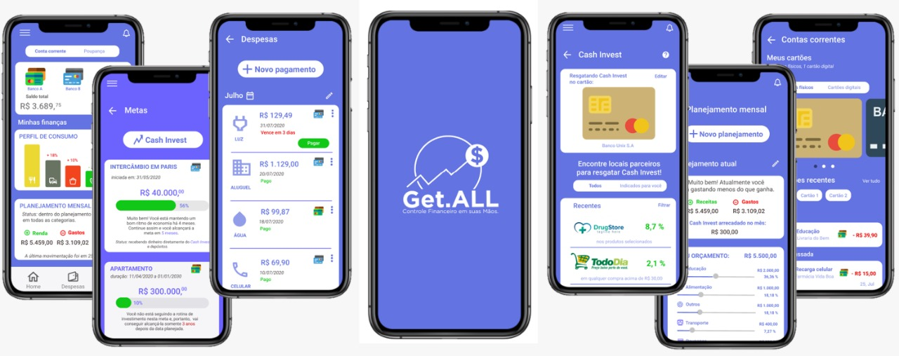

  

<h1> Get.ALL </h1>

## ⛏️ Tecnologias utilizadas
* HTML
* CSS
* JS
* Django
* Heroku
* Python
* sqlite

## 🧐 Sobre
Get.ALL é uma Plataforma Mobile de Agregação Financeira alinhada ao Open Banking que de forma segmentada faz o controle e oferece insights para redução de gastos, promovendo economia e educação financeira, além de contar com o “CashInvest" direcionado para investimento em planos e metas futuras.
Tudo isso em um só lugar!

## ✍️ Time
* Laiana Santiago - Frontend
* Gabriel Ribeiro - Backend
* Maria Gabriela - UI Designer
* Gabrieli Pavlack - UX/UI Designer
* Léo David Cunha - Business / PO
